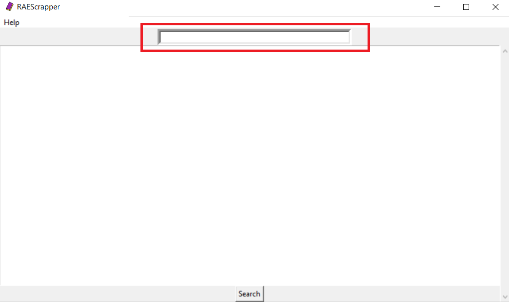
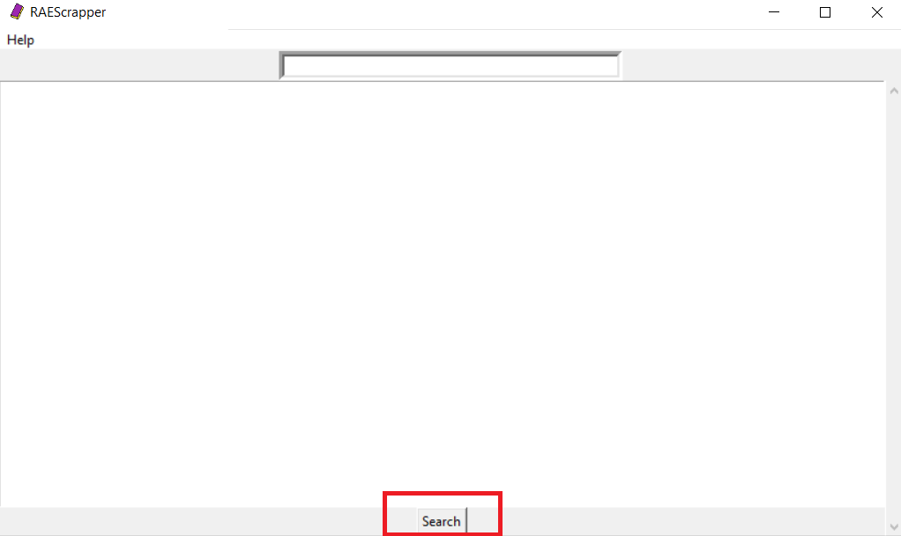
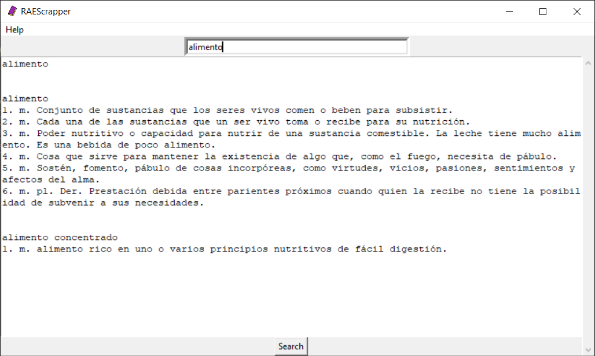

# RAEScrapper

RAEScrapper is a program made in Python to use the Royal Spanish Academy's Spanish Dictionary in your computer, without directly accessing their website (https://www.rae.es/). RAEScrapper still requires internet connection.   
  

# Requirements

• Python 3.x  
• BeautifulSoup (using BS4)   
• Writer (using CSV)   
• Twinker (for the GUI)   
  

# How to use

1) Input the word you want to look for in the input box located at the top of the program.

2) Press the search button.

3) Results should appear in the program window.

# License

MIT License - All contributions are appreciated.

# Author

Pedro Ignacio Alcala Durand.
